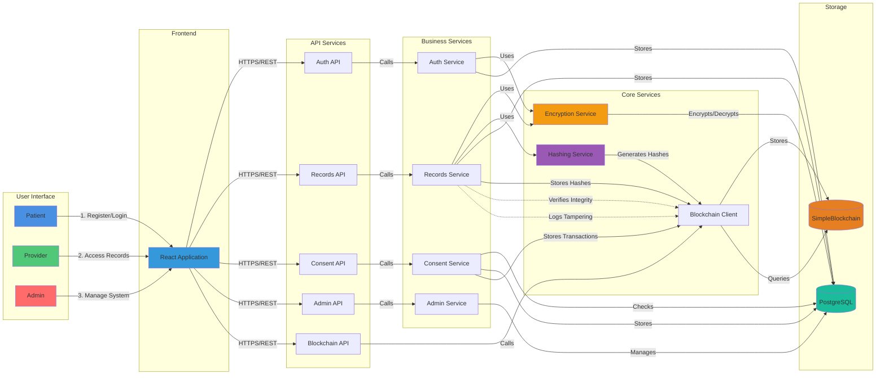

# System Architecture

## Overview

This document outlines the architecture for the Healthcare Blockchain prototype, detailing how the system components interact to provide secure, patient-controlled medical records management.

## System Layers

```
┌─────────────────────────────────────────────────────────────┐
│                        Frontend Layer                       │
│                    (React + Vite + Tailwind)                │
│  ┌─────────────┐  ┌─────────────┐  ┌────────────┐           │
│  │   Patient   │  │  Provider   │  │    Admin   │           │
│  │    Portal   │  │    Portal   │  │   Portal   │           │
│  │             │  │             │  │  Dashboard │           │
│  └──────┬──────┘  └──────┬──────┘  └─────┬──────┘           │
│         │                │               │                  │
│         └────────────────┴───────────────┘                  │
│              Blockchain Explorer UI                         │
└─────────┼────────────────┼───────────────┼──────────────────┘
          │                │               │
          │          HTTPS/REST API (CORS) │
          │                │               │
┌─────────▼────────────────▼───────────────▼──────────────────┐
│                       API Gateway Layer                     │
│                    (FastAPI Application)                    │
│  ┌──────────┐  ┌──────────┐  ┌──────────┐  ┌──────────┐     │
│  │   Auth   │  │ Records  │  │  Consent │  │  Admin   │     │
│  │  Service │  │ Service  │  │ Service  │  │ Service  │     │
│  └──────────┘  └──────────┘  └──────────┘  └──────────┘     │
│                                                             │
│  ┌──────────────────────────────────────────────────────-┐  │
│  │              Blockchain API Service                   │  │
│  │  • Query transactions                                 │  │
│  │  • Get blocks                                         │  │
│  │  • View tampering events                              │  │
│  │  • Validate chain                                     │  │
│  └──────────────────────────────────────────────────────-┘  │
└─────────┬───────────────────────────────────────────────────┘
          │
          │
┌─────────▼────────────────────────────────────────────────────┐
│                    Business Logic Layer                      │
│  • Encryption/Decryption (AES-256)                           │
│  • Hash Generation (SHA-256)                                 │
│  • Integrity Verification (Blockchain hash comparison)       │
│  • Tampering Detection & Logging                             │
│  • RBAC (Role-Based Access Control)                          │
│  • JWT Token Management                                      │
└─────────┬────────────────────────────────────────────────────┘
          │
          │
┌─────────▼──────────────┐          ┌─────────────────────────┐
│   Blockchain Layer     │          │     Storage Layer       │
│   (SimpleBlockchain)   │          │   (PostgreSQL/Supabase) │
│                        │          │                         │
│  • Record Hash Storage │          │  • Encrypted medical    │
│  • Consent Transactions│          │    records (off-chain)  │
│  • Tampering Events    │          │  • User credentials     │
│  • Access Logging      │          │  • Consent records      │
│  • Audit Trail         │          │  • Metadata             │
│  • Proof-of-Work       │          │  • Access logs          │
│  • Chain Validation    │          │                         │
│                        │          │  Database: PostgreSQL   │
│  Storage: JSON file    │          │  (Supabase Cloud)       │
│  (blockchain_data.json)│          │                         │
└────────────────────────┘          └─────────────────────────┘
```

## Core Components

### 1. Frontend Layer
**Technology**: React, Vite, Tailwind CSS, React Router, Axios

**Components**:
- **Patient Portal**: Registration, record upload, consent management, record viewing, blockchain explorer
- **Provider Portal**: Login, record access (with consent), record viewing, blockchain explorer
- **Admin Portal**: Provider approval/rejection, system monitoring, blockchain status, tampering events
- **Blockchain Explorer**: View all blocks, transactions, tampering events, chain validation

**Responsibilities**:
- User interface for all stakeholders
- Form validation and user input handling
- JWT token management (localStorage)
- API communication via Axios
- Real-time blockchain data visualization
- Responsive design with Tailwind CSS

---

### 2. API Gateway Layer (FastAPI)
**Technology**: Python, FastAPI

**Services**:

#### Authentication Service
- User registration and login
- JWT token generation and validation
- Cryptographic identity generation (public/private keys)
- Password hashing

#### Records Service
- Medical record upload and validation
- Hash generation (SHA-256)
- Integration with blockchain for hash storage
- Integration with storage layer for encrypted data
- Record retrieval and decryption
- **Blockchain integrity verification** (hash comparison)
- **Tampering detection** (hash mismatch detection)
- **Tampering event logging** to blockchain

#### Consent Service
- Consent granting/revocation
- Blockchain transaction storage (consent transactions)
- Consent status checking
- Provider access validation
- Consent expiration handling

#### Admin Service
- Provider approval/rejection
- System status monitoring
- Blockchain health checks
- Provider management

#### Blockchain API Service
- Query blockchain transactions
- Get blocks and chain information
- View tampering detection events
- Validate blockchain integrity
- Transaction filtering by type

---

### 3. Business Logic Layer
**Technology**: Python

**Key Modules**:

- **Encryption Module**:
  - AES-256 encryption for medical records
  - Key derivation and management (PBKDF2)
  - Secure key storage (environment variables)
  - Private key encryption for user keys

- **Hash Generation**:
  - SHA-256 hash computation
  - Ensures data integrity
  - Hash comparison for tampering detection

- **Blockchain Client Interface**:
  - SimpleBlockchain integration
  - Transaction creation and storage
  - Transaction querying
  - Tampering event logging
  - Chain validation

- **Access Control**:
  - RBAC implementation (Patient, Provider, Admin)
  - Permission checking via JWT middleware
  - Role validation
  - Consent-based access control

- **Integrity Verification**:
  - Blockchain hash comparison
  - Content hash verification
  - Tampering detection (hash mismatch, tx_id mismatch, content corruption)
  - Automatic tampering event logging

---

### 4. Blockchain Layer
**Technology**: SimpleBlockchain (Python-native implementation)

**On-Chain Data**:
- Medical record hashes (SHA-256)
- Consent transactions (grant/revoke)
- **Tampering detection events**
- Access logs (who accessed what, when)
- Provider-patient relationships

**Blockchain Features**:
- **Proof-of-Work**: Mining with configurable difficulty
- **Block Structure**: Index, transactions, previous_hash, timestamp, nonce
- **Chain Validation**: Cryptographic hash linking between blocks
- **Persistence**: JSON file storage (`blockchain_data.json`)
- **Transaction Types**:
  - `medical_record_hash`: Record hash storage
  - `consent`: Consent grant/revoke transactions
  - `tampering_detection`: Security alerts for tampering attempts
  - `genesis`: Initial block

**Transaction Structure**:
- Transaction ID (unique identifier)
- Transaction type
- Asset data (record_id, patient_id, provider_id, hash, etc.)
- Metadata (operation type, timestamps)
- Public keys (for signing/verification)

---

### 5. Storage Layer (Off-Chain)
**Technology**: PostgreSQL (Supabase Cloud)

**Stored Data**:
- **Encrypted medical records** (AES-256 encrypted)
  - `encrypted_content`: Encrypted record content
  - `hash`: SHA-256 hash of original content
  - `blockchain_tx_id`: Reference to blockchain transaction
  - `record_type`, `record_metadata`: Record classification
- **User credentials** (bcrypt hashed passwords)
  - `email`, `password_hash`, `role`, `name`
  - `public_key`: RSA public key (base64)
  - `private_key_encrypted`: Encrypted RSA private key
  - `is_approved`: Provider approval status
- **Consent records**
  - `patient_id`, `provider_id`, `record_id`
  - `blockchain_tx_id`: Reference to consent transaction
  - `status`: granted/revoked
  - `expires_at`: Optional expiration
- **Access logs**
  - Who accessed what records and when

**Access Pattern**:
- Records accessed only after blockchain integrity verification
- Decryption happens only for authorized access (with valid consent)
- Tampering detection before decryption
- Metadata indexes for fast querying
- Async SQLAlchemy for database operations

---

## Security Architecture

### Authentication Flow
```
1. User provides credentials → Auth Service
2. Credentials validated → Database check
3. JWT token generated → Returned to client
4. Subsequent requests include JWT token
5. Auth Service validates token on each request
```

### Encryption Scheme
```
Plain Record → AES-256 Encryption → Encrypted Storage (Off-Chain)
              ↓
          Hash Generation (SHA-256)
              ↓
          Blockchain Storage (Hash only)
```

### Access Control Flow
```
1. Provider requests record access
2. API checks blockchain for consent
3. If consent exists → Proceed to decrypt record
4. If no consent → Return access denied
5. Log access attempt to blockchain
```

---

## Data Flow Architecture

### Record Upload Flow
```
Patient uploads record
    ↓
API receives record
    ↓
Generate SHA-256 hash
    ↓
Encrypt record with AES-256
    ↓
Store encrypted record off-chain
    ↓
Store hash on blockchain
    ↓
Return success to patient
```

### Record Access Flow
```
Provider requests record
    ↓
API validates JWT token and role
    ↓
Retrieve record from database
    ↓
Verify blockchain integrity:
    - Query blockchain transaction
    - Compare database hash with blockchain hash
    ↓
If hash mismatch (Tampering detected):
    - Log tampering event to blockchain
    - Return error: Record integrity failed
    ↓
If hash matches:
    Check consent on blockchain/database
    ↓
If consent exists and valid:
    ↓
    Decrypt record content
    ↓
    Verify content hash (recalculate and compare)
    ↓
    If content hash mismatch (Tampering detected):
        - Log tampering event to blockchain
        - Return error: Content integrity failed
    ↓
    If content hash matches:
        Return decrypted record to provider
```

### Consent Management Flow
```
Patient creates/updates consent
    ↓
API validates request (patient owns record, provider approved)
    ↓
Generate consent transaction
    ↓
Store consent transaction on blockchain
    ↓
Store consent record in database (with blockchain_tx_id)
    ↓
Return success to patient
```

---

## Technology Stack Summary

| Layer | Technology | Purpose |
|-------|-----------|---------|
| Frontend | React, Vite, Tailwind CSS | User interfaces (Patient, Provider, Admin portals) |
| API Gateway | FastAPI | RESTful API endpoints with CORS |
| Business Logic | Python 3.13 | Encryption, hashing, validation, tampering detection |
| Blockchain | SimpleBlockchain (Python-native) | Immutable ledger, transaction storage, tampering events |
| Storage | PostgreSQL (Supabase) | Encrypted off-chain data, user credentials, consent records |
| Authentication | JWT (access + refresh tokens) | Secure token-based auth |
| Encryption | AES-256 (CBC mode) | Data encryption for medical records and private keys |
| Hashing | SHA-256 | Data integrity verification |
| Database ORM | SQLAlchemy (async) | Database operations and migrations |
| Password Hashing | bcrypt | Secure password storage |
| Key Management | RSA 2048-bit | Cryptographic key pairs for blockchain operations |

---

## High-Level System Architecture

```mermaid
graph TB
    subgraph "Frontend"
        Frontend[React Application<br/>Patient, Provider, Admin Portals]
    end
    
    subgraph "API Layer"
        API[FastAPI REST API<br/>Authentication, Records,<br/>Consent, Admin, Blockchain]
    end
    
    subgraph "Business Logic"
        Logic[Business Logic<br/>Encryption, Hashing,<br/>Integrity Verification,<br/>Access Control]
    end
    
    subgraph "Data Storage"
        Blockchain[SimpleBlockchain<br/>Immutable Ledger<br/>Record Hashes, Consents,<br/>Tampering Events]
        Database[(PostgreSQL<br/>Supabase Cloud<br/>Encrypted Records,<br/>Users, Consents)]
    end
    
    Frontend -->|HTTPS/REST| API
    API --> Logic
    Logic --> Blockchain
    Logic --> Database
    
    style Frontend fill:#4A90E2
    style API fill:#3498DB
    style Logic fill:#9B59B6
    style Blockchain fill:#E67E22
    style Database fill:#1ABC9C
```

---

## Deployment Architecture

```
                    Internet
                       ↓
              [ Load Balancer ]
                       ↓
            ┌──────────┴──────────┐
    [Frontend Server]     [API Server]
            │                    │
            │              ┌─────┴─────┐
            │         [Blockchain]  [Database]
            │                         
            └─────────────────────────┘
                  (Direct API calls)
```

---

## Component Interaction Diagram



**Key Interactions:**
- **Users** interact with **Frontend** (React)
- **Frontend** communicates with **API Services** via HTTPS/REST
- **API Services** call **Business Services** for logic
- **Business Services** use **Core Services** (Encryption, Hashing)
- **All services** store data in **Database** (PostgreSQL)
- **Records & Consent** transactions stored on **Blockchain**
- **Integrity verification** checks blockchain before access

---

## Scalability Considerations

- **Horizontal Scaling**: Frontend and API servers can be scaled independently
- **Database Sharding**: Patient data can be sharded by region or ID
- **Blockchain**: Use federated nodes for better throughput
- **Caching**: Redis for frequently accessed consent status
- **CDN**: For frontend static assets


